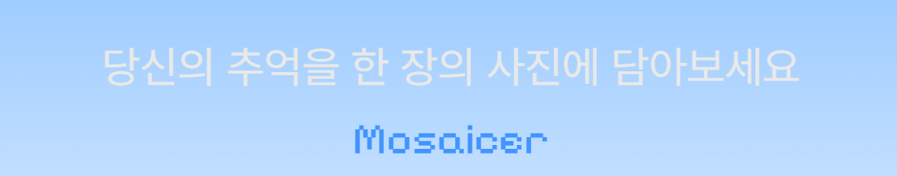

  

    
    
    
    
     
    
     
    
    

## 개요

Mosaicer는 메인 이미지를 여러 타일 이미지들로 구성해 하나의 모자이크 아트로 재구성하는 웹 서비스입니다.

## 주요 기능

### 1. 메인 이미지 선택
모자이크의 기준이 되는 이미지를 업로드합니다.

### 2. 타일 이미지 선택
모자이크를 구성할 다수의 타일 이미지를 업로드합니다.

### 3. 세부 설정
- 타일 개수
- 타일 크기
- 해상도
- 업스케일 옵션

설정값에 따라 결과 이미지의 디테일이 달라집니다.

### 4. 모자이크 생성
브라우저에서 OpenCV 기반 연산을 통해 결과 이미지를 생성합니다.

### 5. 다운로드
완성된 이미지를 로컬로 저장할 수 있습니다.
